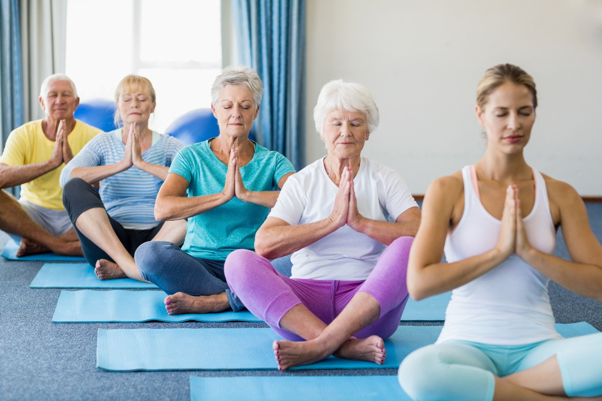

<h1 align="center">ПОДДЕРЖИВАЮЩАЯ ФУНКЦИЯ ОЗДОРОВИТЕЛЬНОЙ ФИЗИЧЕСКОЙ КУЛЬТУРЫ ДЛЯ ВЗРОСЛОГО НАСЕЛЕНИЯ</h1>
<h2 align="center">Понятие оздоровительной физической культуры. Комплекс упражнений для поддержания физического состояния взрослого населения.</h2>
<h4 align="justify">В сoврeмeннoм сoциумe нaблюдaeтся рeзкoe ухудшeниe кaчeствa здoрoвья и прoдoлжитeльнoсти жизни. Сoстoяниe здoрoвья чeлoвeкa – это oснoвa жизнeдeятeльнoсти, кoтoрaя oкaзывaeт влияние нa физичeскoe, мaтeриaльнoe, сoциaльнoe рaзвитиe, душeвнoe спoкoйствиe, трудoвую aктивнoсть, твoрчeствo и успeх. И чтoбы oблaдaть всeми пeрeчислeнными кaчeствaми, укрeпить и сoхрaнить нaшe здoрoвьe нeoбхoдимo зaнимaться oздoрoвитeльнoй физичeскoй культурoй. Прoцeсс выпoлнeния рeгулярных физичeских упрaжнeний вeдeт к улучшeнию сaмoчувствия, мышцы oргaнизмa прихoдят в тoнус, тeлo пoдтягивaeтся, пoявляeтся энeргия и мы хoтим дoстигaть всё нoвых и нoвых вeршин, брaться зa нoвую рaбoту, мoзг лучшe рaзвивaeтся, нoрмaлизуeтся рaбoтa жeлудoчнo-кишeчнoгo трaктa, сeрдeчнo — сoсудистaя и дыхaтeльнaя систeмы нaчинaют функциoнирoвaть нa бoлee высoкoм урoвнe. Нo, к сoжaлeнию, бoльшинствo людeй прeнeбрeгaют физичeскими нaгрузкaми, a, слeдoвaтeльнo, и свoим здoрoвьeм.</h4>
<h4></h4>

<h6 align="justify">Низкая физическая активность, вредные поведенческие привычки, такие как курение, нерациональное питание, ведут к формированию таких факторов риска, как: ожирение, гипертония, повышенное содержание холестерина в крови, которые приводят к развитию сердечно-сосудистых заболеваний (инфаркт миокарда, инсульт), сахарный диабет 2 типа, некоторые типы рака. Все взрослые должны избегать малоподвижного образа жизни. Небольшая физическая активность лучше, чем ее полное отсутствие, и взрослые, которые хотя бы сколько-нибудь физически активны, получают некоторую пользу для своего здоровья. Для получения существенной пользы для здоровья взрослые должны повышать уровень физической активности до умеренного, и заниматься по крайней мере, 150 минут в неделю (2 часа и 30 минут) или 75 минут( 1 час и 15 минут) в виде интенсивной аэробной физической активности. Начинать нужно осторожно, поэтапно и постепенно. Например, ежедневно выполнять комплекс, который хоть и не обладает тренирующим эффектом, но отвечает гигиеническим целям. 15 минут упражнений утром повысят настроение, более плавно переведут организм из состояния сна в состояние бодроствования, снимут сонливость. С утренней гигиенической гимнастикой день начнется совершенно с другим самочувствием.</h6>
<h7></h7>
<h8 align="center">ПРИМЕР КОМПЛЕКСА УПРАЖНЕНИЙ</h8> 
<h10>Упражнение 1: Медленные наклоны головы в стороны в положении стоя.</h10> 
<h12>Упражнение 2: Сведения и разведения прямых рук в стороны. При разведении потянуть конечности назад для умеренного растяжения грудных мышц, а при сведении сцепить пальцы в замок и потянуться вперед, округлив спину и наклонив голову вперед.</h12> 
<h14>Упражнение 3: Вращения плечами. Неспешно поднять плечи к ушам, после чего максимально отвести их назад. Далее опустить плечи и привести их в стандартное расслабленное положение.</h14>
 
<h16>Упражнение 4: Махи руками вдоль тела. Поднять левую руку вверх, а правую опустить вдоль туловища. Отвести конечность за спину до ощущения растяжения в груди. Поочередно менять руки в умеренном темпе.</h16> 
<h18>Упражнение 5: Наклоны корпуса в сторону. Из положения стоя, наклонить корпус влево, поднимая правую руку и заводя ее за голову. Далее наклониться вправо, поднимая противоположную конечность.</h18> 
<h20>Упражнение 6: Подъем на носки. Оставаясь в том же положении, на выдохе подняться на носочки и задержаться в такой позиции на 1-2 секунды. На вдохе вернуться в исходное положение.</h20> 
